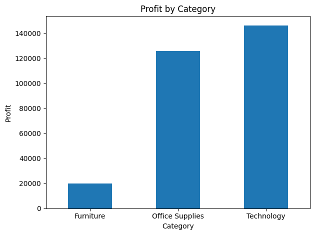
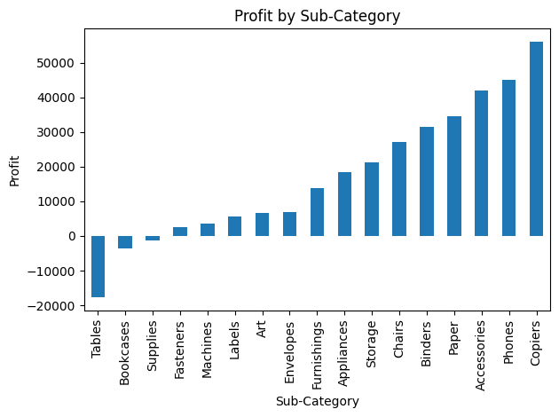
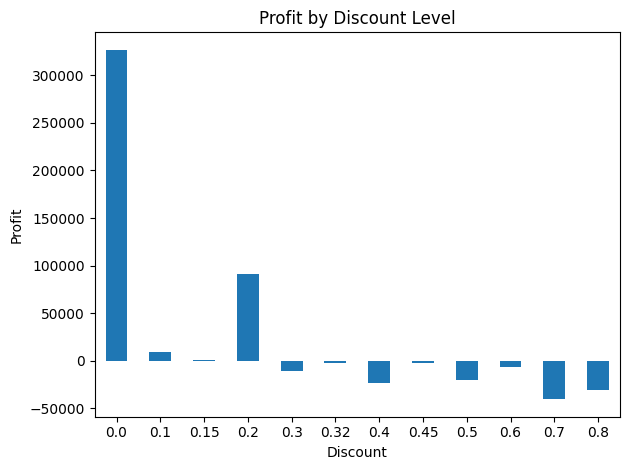
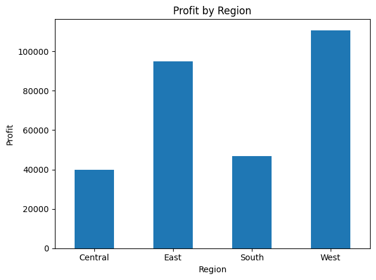

# Superstore Sales & Profit Analysis

A business-focused data analysis project identifying profitability issues and optimization opportunities in retail sales data. 

This project analyzes retail sales data to identify key drivers of profitability and uncover loss-making areas across categories, sub-categories, and regions.

## Objective

The goal of this project is to:

- Analyze sales and profit performance across product categories
- Identify loss-making products and sub-categories
- Understand the impact of discounts on profitability
- Provide data-driven business recommendations

## 🛠️ Tools & Technologies

- Python (pandas, matplotlib)
- SQL (SQLite)
- Excel (data exploration)
- Jupyter Notebook (analysis)

## Dataset

The dataset contains approximately 10,000 retail transactions, including:

- Sales and Profit
- Discount levels
- Product categories and sub-categories
- Regional information

The data is clean with no missing values.

## Key Analysis

The analysis includes:

- Category-level sales and profit comparison
- Sub-category performance analysis
- Discount vs Profit relationship
- Regional profitability analysis

## Key Insights

- Technology is the most profitable category, leading in both sales and profit
- Furniture shows relatively high sales but significantly lower profitability, indicating margin pressure
- Tables is the most loss-making sub-category
- Higher discount levels are strongly associated with reduced profitability
- Profitability varies across regions, suggesting operational or pricing differences

## 📊 Sample Visualizations

Below are key visualizations from the analysis:





## Business Recommendations

- Review pricing and discount strategy for Furniture, especially Tables
- Reduce excessive discounting on low-margin products
- Focus on high-performing categories like Technology
- Investigate loss-making products to improve margins

## Project Structure
```
Business_analytics/
│
├── data/
│   ├── sample_superstore.csv
│   └── sample_superstore.xls
│
├── notebooks/
│   └── superstore_profit_analysis.ipynb
│
├── SQL/
│   └── queries.sql
│
├── PowerBI/
│   └── 
│
├── .gitignore
├── README.md
└── requirements.txt 
```
## 🚀 How to Run

1. Clone this repository
2. Open the notebook:
   notebooks/superstore_profit_analysis.ipynb
3. Run all cells to reproduce the analysis

## 🔮 Future Improvements

- Build an interactive Power BI dashboard
- Perform time-series analysis on sales trends
- Explore customer segmentation